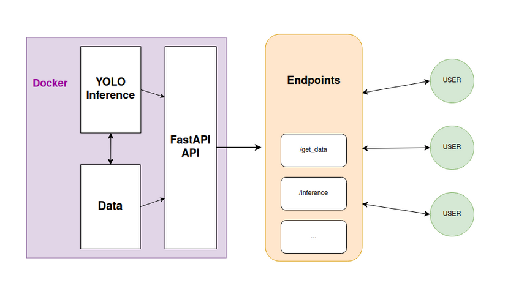
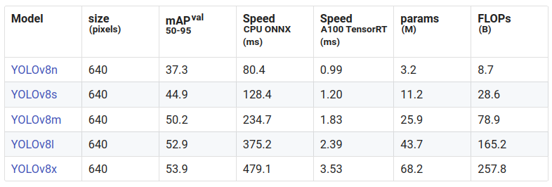

# YOLOv8-docker

REST API which exposes endpoints for YOLOv8 inference, all running in a Docker Container. The docker container launches a FastAPI API on localhost, which exposes multiple endpoints. These endpoints offer YOLOv8 inference-related functionalities, such as inference on images stored on the device, inference on files sent through the API or getters and setters for the available images.



In the above image the structure of the project, as well as the main components of the Docker container are illustrated. Those components are:

- The YOLO Inference module, which performs inference processes.
- The Data required for performing object detection inference (images).
- The FastAPI API which exposes endpoints that, in order to perform their corresponding behavior, interacts with both the YOLO Inference and Data components.

# Requirements

- **Docker** must be installed in your computer in order to execute this Docker container. For the Docker installation, the best option is to follow the steps from the official Docker website: https://docs.docker.com/get-docker/

# Usage

1. Clone this repository

```bash
git clone https://github.com/JavierMtz5/YOLOv8-docker.git
```

2. Configure the Docker container by editing the configuration variables in the **start.sh** script (lines 4-11):

```bash
# Configuration values
IMAGE_NAME="<docker_image_name>"                             # Edit this value
IMAGE_TAG="<docker_image_tag>"                               # Edit this value
FULL_IMAGE_NAME="${IMAGE_NAME}:${IMAGE_TAG}"
WORKING_DIR="/home/app"
LOCAL_INFERENCE_RESULTS_DIR="<local_inference_results_path>" # Edit this value
LOCAL_DATA_DIR="<local_data_directory>"                      # Edit this value
DOCKER_INFERENCE_RESULTS_DIR="${WORKING_DIR}/runs"
DOCKER_DATA_DIR="${WORKING_DIR}/data"
```

**Configuration values description**:

>
> ###### *IMAGE_NAME*
> 
> Name of the docker image to be generated.
> 
> ###### *IMAGE_TAG*
> 
> Tag of the docker image to be generated
> 
> ###### *LOCAL_INFERENCE_RESULTS_DIR*
> 
> Local directory where all inference data will be saved. A volume is mounted between the provided *LOCAL_INFERENCE_RESULTS_DIR* and the docker directory where inference data is saved. This way, when inference is performed inside the Docker container, results are saved in the container directory **/home/app/runs**, and thus in the provided *LOCAL_INFERENCE_RESULTS_DIR* local directory.
> 
> ###### *LOCAL_DATA_DIR*
> 
> Local directory where all data required for inference is located. A volume is mounted between the provided *LOCAL_DATA_DIR* and the docker directory where data is retrieved from. This way, when performing inference over a batch of images, those images will be found in the local *LOCAL_DATA_DIR* directory, and thus in the container directory **/home/app/data**.

3. Build and run the docker container by executing the **start.sh** script

From the repository directory, run the following command:

```bash
./start.sh
```

This will remove all existing Docker images with the same name and tag as the ones provided in the **IMAGE_NAME** and **IMAGE_TAG** configuration values, and will remove all existing Docker containers, in order to save memory.

> **NOTE**: If you want to run other Docker containers while using this one, build and run the docker image manually, which will not delete the running Docker containers.
>
> From this repository's directory, run:
>
> ```bash
> docker build -t <image_name>:<tag> .
> docker run -d --ipc=host --gpus all -p 8080:8080 -v <local_inference_results_dir>:/home/app/runs -v <local_data_dir>:/home/app/data <image_name>:<tag>
> ```

4. (Optional) Check the container's logs:

```bash
docker logs -f <docker_container_id>
```

5. Call the health check endpoint to test the API

```python
import requests

url = "http://0.0.0.0:8080/"
response = requests.request("GET", url)

print(response.json())
```

If the API returns a code 200 response, it is working fine.

1. Check the API Docs by accesing the following URL in your browser: http://0.0.0.0:8080/docs

# Inference

There are two ways to perform inference:

1. Perform inference on a set of local images calling the **/detect** endpoint. 
   
2. Perform inference on a single image sent through the API, by calling the **/detect_img** endpoint.

#### GET /detect

This endpoint **receives as query parameter a path to the container directory (with / replaced by $) which contains the images to apply inference to**. As explained in the configuration section, the docker container mounts a volume between the provided *LOCAL_DATA_DIR* and the docker directory where data is retrieved from, so you can add new images to the local *LOCAL_DATA_DIR* directory in your PC and they will also be in the **/home/app/data/** directory inside the container.

```python
import requests

url = "http://0.0.0.0:8080/detect?path=$docker$path$to$images$directory"
response = requests.request("GET", url)

print(response.json())

```

#### POST /detect_img

This endpoint **receives as payload the image on which inference should be applied**. This endpoint should not be used for batch inference, as the image is sent through the network before performing inference, causing high inference time per image.

```python
import requests
import base64

filename = "local/path/to/file.jpg"
files = {"img": (filename, open(filename, 'rb'), "image/jpeg")}
response = requests.post(
    'http://127.0.0.1:8080/detect_img',
    files=files
)
print(response.json())

```

### Get the images inside the Docker container available for inference

As explained for the **/detect** endpoint, the query parameter must be the docker conatiner path to the directory which contains the images. Therefore, it is useful to provide a getter endpoint, which returns the available image files in a given directory.

#### GET /images

This endpoint returns a list of all *JPG* or *PNG* files inside the docker directory received as query parameter. It is useful for checking which directory to apply inference to via the **/detect** endpoint.

# YOLOv8 Model

The YOLOv8 model running on the API backend is the YOLOv8m model, which provides a good balance between inference time and accuracy.



Source: https://docs.ultralytics.com/models/yolov8/#supported-tasks-and-modes
